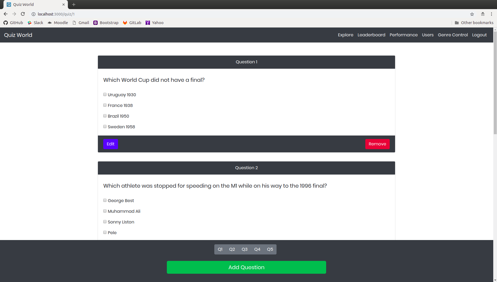

# Quiz World
A web app for quizzing developed using Go and React.
## Description:
The app presents a ***Bootstrap 4*** styled UI in ***React*** supported by a ***Go*** server which implements features such as but not limited to, authentication, registration and quizzing capabilities along with admin support which allows admins to modify genres, quizzes and questions.

## Technologies used:
* [React](https://reactjs.org/)
* [Go](https://golang.org/)
* [Bootstrap 4](http://getbootstrap.com/)

## Setting up:
### React
  - Install **node**
    - Ubuntu:
      ```bash
        curl -sL https://deb.nodesource.com/setup_10.x | sudo -E bash -
        sudo apt-get install -y nodejs
      ```
    - MacOS:
      ```bash
        brew install node
      ```
  - Install **yarn**
      ```bash
        npm install -g yarn
        yarn global add create-react-app
      ```
  - Install packages for **React**:
    ```bash
      cd ./quiz-app/quiz-app-react/
      npm install
      yarn install
    ```

### Go  
  - Install **Go**
    - For Ubuntu: [Look here](https://www.linode.com/docs/development/go/install-go-on-ubuntu/)
    - For MacOS: [Look here](http://sourabhbajaj.com/mac-setup/Go/README.html)
  - Install Go packages by running the following commands on your terminal:
    ```bash
      go get -u -v golang.org/x/crypto/bcrypt
      go get -u -v github.com/gin-contrib/cors
      go get -u -v github.com/gin-gonic/gin
      go get -u -v github.com/jinzhu/gorm
    ```

## To run:
After set-up, run:
- In the [frontend directory](./frontend/), run  
  ```bash
    nodemon
  ``` 
- In the [root directory](./), run
  ```bash
    go run app.go
  ```

## Sample Images:

***Index Page***


***Login Page***


***Signup Page***


***User's Index Page***


***Genres catalog for admin***


***Quizzes catalog for admin***


***Soccer Quiz (Admin View)***



***Leaderboard across Genres***


***Person Performance***


***Genre Control***


More sample images ***[here](./sample-images/)***
